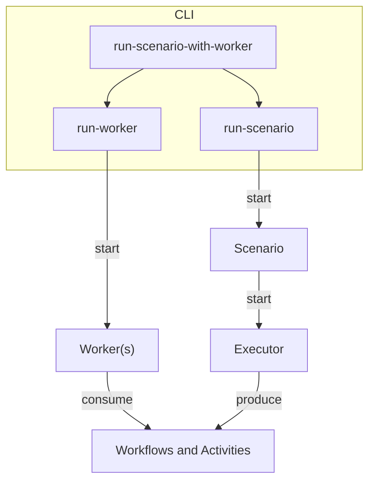

# Omes - a load generator for Temporal

This project is for testing load generation scenarios against Temporal. This is primarily used by the Temporal team to
benchmark features and situations. Backwards compatibility may not be maintained.

## Why the weird name?

Omes (pronounced oh-mess) is the Hebrew word for "load" (עומס).

## Prerequisites

- [Go](https://golang.org/) 1.25+
  - `protoc` + `protoc-gen-go` or [mise](https://mise.jdx.dev/) for [Kitchen Sink Workflow](#kitchen-sink-workflow)
- [Java](https://openjdk.org/) 8+
- TypeScript: [Node](https://nodejs.org) 16+
- Python: [uv](https://docs.astral.sh/uv/)
- [.NET](https://dotnet.microsoft.com/en-us/download)

And if you're running the fuzzer (see below)
- [Rust](https://rustup.rs/)

SDK and tool versions are defined in `versions.env`.

## Architecture

This (simplified) diagram shows the main components of Omes:



* **Scenario**: starts an Executor to run a particular load configuration
* **Executor**: produces concurrent executions of workflows and activities requested by the Scenario
* **Workers**: consumes the workflows and activities started by the Executor

## Usage

### Define a scenario

Scenarios are defined using plain Go code. They are located in the [scenarios](./scenarios/) folder. There are already
multiple defined that can be used.

A scenario must select an `Executor`. The most common is the `KitchenSinkExecutor` which is a wrapper on the
`GenericExecutor` specific for executing the Kitchen Sink workflow. The Kitchen Sink workflow accepts
[actions](./workers/go/kitchensink/kitchen_sink.go) and is implemented in every worker language.

For example, here is [scenarios/workflow_with_single_noop_activity.go](scenarios/workflow_with_single_noop_activity.go):

```go
func init() {
	loadgen.MustRegisterScenario(loadgen.Scenario{
		Description: "Each iteration executes a single workflow with a noop activity.",
		Executor: loadgen.KitchenSinkExecutor{
			WorkflowParams: kitchensink.NewWorkflowParams(kitchensink.NopActionExecuteActivity),
		},
	})
}
```

> NOTE: The file name where the `Register` function is called, will be used as the name of the scenario.

#### Scenario Authoring Guidelines

1. Use snake case for scenario file names.
1. Use `KitchenSinkExecutor` for most basic scenarios, adding common/generic actions as need, but for unique
   scenarios use `GenericExecutor`.
1. When using `GenericExecutor`, use methods of `*loadgen.Run` in your `Execute` as much as possible.
1. Liberally add helpers to the `loadgen` package that will be useful to other scenario authors.

### Run scenario with worker - Start a worker, an optional dev server, and run a scenario

During local development it's typically easiest to run both the worker and the scenario together.
You can do that like follows. If you want an embedded server rather than one you've already started,
pass `--embedded-server`.

```sh
go run ./cmd run-scenario-with-worker --scenario workflow_with_single_noop_activity --language go
```

Notes:

- Cleanup is **not** automatically performed here
- Accepts combined flags for `run-worker` and `run-scenario` commands

### Run a worker for a specific language SDK

```sh
go run ./cmd run-worker --run-id local-test-run --language go
```

Notes:

- `--embedded-server` can be passed here to start an embedded localhost server
- `--task-queue-suffix-index-start` and `--task-queue-suffix-index-end` represent an inclusive range for running the
  worker on multiple task queues. The process will create a worker for every task queue from `<task-queue>-<start>`
  through `<task-queue>-end`. This only applies to multi-task-queue scenarios.

### Run a test scenario

```sh
go run ./cmd run-scenario --scenario workflow_with_single_noop_activity --run-id local-test-run
```

Notes:

- Run ID is used to derive ID prefixes and the task queue name, it should be used to start a worker on the correct task queue
  and by the cleanup script.
- By default the number of iterations or duration is specified in the scenario config. They can be overridden with CLI
  flags.
- See help output for available flags.

### Cleanup after scenario run

```sh
go run ./cmd cleanup-scenario --scenario workflow_with_single_noop_activity --run-id local-test-run
```

### Running a specific version of the SDK

The `--version` flag can be used to specify a version of the SDK to use, it accepts either
a version number like `v1.24.0` or you can also pass a local path to use a local SDK version.
This is useful while testing unreleased or in-development versions of the SDK.

```sh
go run ./cmd run-scenario-with-worker --scenario workflow_with_single_noop_activity --language go --version /path/to/go-sdk
```

### Building and publishing docker images

For example, to build a go worker image using v1.24.0 of the Temporal Go SDK:

```sh
go run ./cmd build-worker-image --language go --version v1.24.0
```

This will produce an image tagged like `<current git commit hash>-go-v1.24.0`.

Publishing images is typically done via CI, using the `push-images` command. See the GHA workflows
for more.

## Specific Scenarios

### ThroughputStress (Go only)

#### Sleep Activity

The throughput_stress scenario can be configured to run "sleep" activities with different configurations.

The configuration is done via a JSON file, which is passed to the scenario with the
`--option sleep-activity-per-priority-json=@<file>` flag. Example:

```
echo '{"count":{"type":"fixed","value":5},"groups":{"high":{"weight":2,"sleepDuration":{"type":"uniform","min":"2s","max":"4s"}},"low":{"weight":3,"sleepDuration":{"type":"discrete","weights":{"5s":3,"10s":1}}}}}' > sleep.json
go run ./cmd run-scenario-with-worker --scenario throughput_stress --language go --option sleep-activity-json=@sleep.json --run-id default-run-id
```

This runs 5 sleep activities per iteration, where "high" has a weight of 2 and sleeps for a random duration between 2-4s,
and "low" has a weight of 3 and sleeps for either 5s or 10s.

Look at `DistributionField` to learn more about different kinds of distrbutions.

#### Nexus 

The throughput_stress scenario can generate Nexus load if the scenario is started with `--option nexus-endpoint=my-nexus-endpoint`:

   ```
   temporal operator nexus endpoint create \
   --name my-nexus-endpoint \
   --target-namespace default \ # Change if needed
   --target-task-queue throughput_stress:default-run-id
   ```

1. Start the scenario with the given run-id:

  ```
  go run ./cmd run-scenario-with-worker --scenario throughput_stress --language go --option nexus-endpoint=my-nexus-endpoint --run-id default-run-id
  ```

### Fuzzer

The fuzzer scenario makes use of the kitchen sink workflow (see below) to exercise a wide
range of possible actions. Actions are pre-generated by the `kitchen-sink-gen` tool, written in
Rust, and are some combination of actions provided to the workflow as input, and actions to be
run by a client inside the scenario executor.

You can run the fuzzer with new random actions like so:

```sh
go run ./cmd run-scenario-with-worker --scenario fuzzer --iterations 1 --language cs
```

By default, the scenario will spit out a `last_fuzz_run.proto` binary file containing the generated
actions. To re-run the same set of actions, you can pass in such a file like so:

```sh
go run ./cmd run-scenario-with-worker --scenario fuzzer --iterations 1 --language cs --option input-file=last_fuzz_run.proto
```

Or you can run with a specific seed (seeds are printed at the start of the scenario):

```sh
go run ./cmd run-scenario-with-worker --scenario fuzzer --iterations 1 --language cs --option seed=131962944538087455
```

However, the fuzzer is also sensitive to its configuration, and thus the seed will only produce
the exact same set of actions if the config has also not changed. Thus you should prefer to save
binary files rather than seeds.

Please do collect interesting fuzz cases in the `scenarios/fuzz_cases.yaml` file. This file
currently has seeds, but could also easily reference stored binary files instead.

## Design decisions

### Kitchen Sink Workflow

The Kitchen Sink workflows accepts a DSL generated by the `kitchen-sink-gen` Rust tool, allowing us
to test a wide variety of scenarios without having to imagine all possible edge cases that could
come up in workflows. Input may be saved for regression testing, or hand written for specific cases.

Build by running `scripts/build-kitchensink.sh`.
Test by running `go test -v ./loadgen -run TestKitchenSink`.
Prefix with env variable `SDK=<sdk>` to test a specific SDK only.

### Scenario Failure

A scenario can only fail if an `Execute` method returns an error, that means the control is fully in the scenario
authors's hands. For enforcing a timeout for a scenario, use options like workflow execution timeouts or write a
workflow that waits for a signal for a configurable amount of time.

## TODO

- Nicer output that includes resource utilization for the worker (when running all-in-one)
- Ruby worker

## Development

The `scripts/` directory contains helper scripts to automate common development tasks:

- **Installation**: `install-all.sh` installs all tools, or use individual `install-<tool>.sh` script
- **Linting**: `lint-all.sh` lints all workers, or use individual `lint-<language>-worker.sh` script
- **Building**: `build-all.sh` builds all workers, or use individual `build-<language>-worker.sh` script

Note that the installation scripts rely on [mise](https://mise.jdx.dev/); but you can also install the tools manually.
All versions are defined in `versions.env`.

## Fuzzer trophy case

* Python upsert SA with no initial attributes: [PR](https://github.com/temporalio/sdk-python/pull/440)
* Core cancel-before-start on abandon activities: [PR](https://github.com/temporalio/sdk-core/pull/652)
* Core panic on evicting run with buffered tasks: [PR](https://github.com/temporalio/sdk-core/pull/660)
* Out of order replay for local activity + cancel: [PR](https://github.com/temporalio/sdk-core/issues/803)
